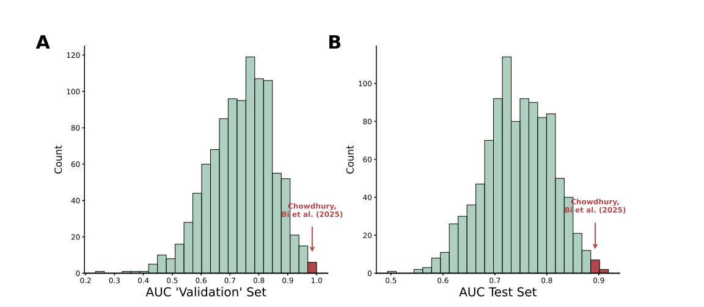

# Overstated Predictive Performance of a Pain Sensitivity Biomarker

| Authors      | Ole Goltermann          | Tamas Spisak       | Christian Büchel         |
|:-------------|:---------------------------|:----------------------|:---------------------|
| **Contact**  | o.goltermann[@]uke.de  | tamas.spisak[@]uk-essen.de | buechel[@]uke.de  |


#

This repository contains code for the re-analysis of the paper: ["Predicting Individual Pain Sensitivity Using a Novel Cortical Biomarker Signature"](https://jamanetwork.com/journals/jamaneurology/fullarticle/2829261). The analysis includes the preprocessing and modeling of original data to evaluate predictive models for individual pain sensitivity class (low vs high) based on peak-alpha frequency (PAF) and corticomotor excitability (CME). Based on our results, as well as inconsistencies in the code, we wrote a **Letter to the Editor**. In addition our raised concerns, this repository contains a list of deviations from the pre-registered protocol, inconsistencies in the original code, as well as further comments on the validity of the reported findings. 

**Instructions on how to use our code are at the end of this README.**

---

## Three main concerns about the results reported in the paper

1. The reported AUC of 1 for the validation set is not based on a true validation set and, addtionally, results from using a fixed random seed (=23), which led to an extremely unrepresentative AUC estimate.
  
2. The reported AUC of 0.88 for the test set is based on a single, random train-test split. Given the small overall sample size for this type of analysis, the result is likely susceptible to biases introduced by specific sample characteristics. We found that only 10 out of 1000 iterations produced an AUC as high as 0.88. The probability of observing an AUC of 0.59 or lower is just as high as obtaining the AUC reported in the paper. 


   


**Figure 1**. **(A)** Out of 1,000 sub-samples of 16 individuals taken from the training set (questionably  labeled as ‘validation’ set), only 4 result in an AUC of 1.0 (p=0.004). The mean AUC for this sub-sample is 0.73, matching the cross-validated AUC of the training set, as depicted in the histogram. (B) Out of 1,000 repeated analyses, in which all analysis steps - including the latent growth modelling - were identical to those in the original study, only 10 produced an AUC as high as the one reported in the paper (p=0.01). The joint probability of observing these two metrics is 0.004% (1 out of 25,000).

3. Labeling this approach as “machine learning” is misleading. Although the term is often used broadly, its use here implies a level of complexity and rigor that the data and modeling simply do not support. The dataset includes only 118 individuals, with just 80 in the training set [16 for evaluating performance] and 38 in the test set - numbers that are far too small for parameter-rich models like neural networks. Describing this as a “large dataset” is inaccurate. e models are trained on only two predictors, one of which is binary. Complex models are built to capture intricate patterns in high-dimensional, nonlinear data - not to handle trivial input spaces. Using such models in this context is scientifically unjustified. Unsurprisingly, the simplest model - logistic regression - achieved the best performance.


## Deviations from their [protocol](https://journals.lww.com/painrpts/fulltext/2020/08000/a_novel_cortical_biomarker_signature_for.6.aspx)

Listed below are only deviations that have an impact on the reported metrics, beyond the two critical issues mentioned above.

<table>
  <thead style="background-color: #808080; color: white;">
    <tr>
      <th>Protocol</th>
      <th>What they actually did</th>
      <th>Influence on results</th>
    </tr>
  </thead>
  <tbody>
    <tr>
      <td>Corticomotor excitability on Day 5 (measured as map volume, a continuous variable) as a predictor for the model</td>
      <td>The difference in map volume between Day 0 and Day 5 was calculated and then binarized.</td>
      <td>The original predictor (map volume as a continuous variable) and the non-binarized difference performed worse.</td>
    </tr>
    <tr>
      <td>"The sample of 150 subjects will first be randomly divided into an outer-training set (n = 100) and an outer-testing set (n = 50). The ratios of high- vs low-pain sensitive individuals will be matched between the 2 cohorts" (...) </td>
      <td> Test set is imbalanced. 24 are coded as high, 14 as low pain sensitivity. </td>
      <td> As demonstrated above, the AUC of the test set is unrepresentative and a clear outlier. </td>
    </tr>
  </tbody>
</table>

Adhering to the original pre-registered analysis, we got an AUC = `0.72`, accuracy = `0.68` for the training set and AUC = `0.71`, accuracy = `0.68` for the test set.

## Inconsistencies in the code   

We only report inconsistencies here that have an impact on model performance indices. 

Original Script is [here](https://github.com/DrNahianC/PREDICT_Scripts/blob/main/PREDICT_Scripts-main/Machine%20Learning%20Scripts/ML_classification_PAF_CME.py)

1. **Parameter tuning for Models**: 

     ClassifierTuner is imported, but not used for hyperparamter tuning at all
   
     

2. **Imputing data for training set**:

    Data is imputed in the trainings set for the whole set. That leads to information leakage between the k-folds. 
    
    

    
3. **Parameter space for Classifiers**
    
    Logistic regression: Maximizing maxiter is not a real hyperparameter for logistic regression. 

    

    Gradient Boosting: Learning rate 0.01 is used twice, Max depth of `None` doesn't make sense here

    

    Support Vector Classifier: Optimizing `gamma` doesn't make sense with `kernel='linear'`

    

    Mulit-layer Perceptron: alpha=0 is incorrect, it should always be positive; learning rate options could be added here

    
      
4. **AUC/Accuracy for so-called validation set**

    The authors report an AUC and accuracy of 1 for the 'validation' set. However, as shown above, its not an actual validation set, but rather a small sub-sample of 16 individuals from the training set, using a particular seed (**=23**) to sample these individuals. Here the code, they use to generate this result.

   (1) Here predictors of the training set are assigned to `X` and outcome to `y`

    

   (2) Now (after model training and locking of model), 16 individuals are drawn from the training data (X,y) using a **fixed random seed** of **23** (as shown this leads to an extreme unrepresentative sample that produces an outlier).

    

   (3) AUC is calculated for this sub-sample an reported as validation set AUC. 

    

   (4) The correct AUC to report would be either the average AUC across the 5 folds (**0.65**) or the performance of the locked model in the training set (**0.73**). This is done already here:

    

    We would like to note that it is somewhat unusal that the authors did not report the AUCs already calculated for their 5 folds (internal validation sets), which would have accurately reflect the performance of the models in their particular analysis. Instead, they opted to draw 16 individuals again, using a fixed random seed (=23).

## Further comments 

- The paper reports a wide range of sensitivity analyses. However, it is important to note that these do not affect the issues we raised above. For all their additional analyses, the calculated AUC and accuracy will drop significantly as well.
- Accroding to their protocol, the data was randomly split into training and test sets. However, we were unable to reproduce their partition using scikit-learn’s `train_test_split()` function - despite exhaustively testing all possible seeds between 1 and 2³² - even though this function, along with scikit-learn more generally, is used elsewhere in their scripts.

## Our analysis pipeline  

To reduce the risk of sample characteristic biases on the models performance estimate, we integrated a repeated split into training and test data. Additonally, we do not report metrics for a so called "validation set" but rather only report averaged metrics for training and test data with identical model configuration and sample sizes for the two sets as in the original paper. Our pipeline does the following:

1. **Split data in training and test set**: Sample size for training and test set is the same as in the original study
2. **Run the latent growth model** (based on the Rscript of the original paper) that classifies subjects into low and high pain sensitivity and uses this model for the test set classification as well (this is the "ground truth" for the later classification task)
3. **Model Training and Evaluation**: Trains several machine learning models (e.g., Logistic Regression, Random Forest, Gradient Boosting, SVC, MLPClassifier) 
4. **Result Aggregation**: Aggregates results across multiple random seeds and saves them to CSV files.
5. **Visualization**: Generates bar plots for accuracy and AUC metrics for each model.

## Requirements

To run this code, you need the following Python libraries:
- numpy
- pandas
- scikit-learn
- seaborn
- matplotlib

Ensure you have Python 3.8 or higher installed.

### Installation
You can install the required libraries using:

```bash
pip install -r requirements.txt
```

The `requirements.txt` file contains:

```txt
numpy
pandas
scikit-learn
seaborn
matplotlib
openpyxl
```

## How to Run the Code

1. Clone this repository:

   ```bash
   git clone https://github.com/your_username/PAF_reanalysis.git
   cd PAF_reanalysis
   ```

2. Run the Jupyter notebook

3. Execute the cells in order, ensuring the data files are in the specified `basepath`. The path is determined automatically. 

4. Results will be saved in CSV format:
   - `results_all_runs.csv`: Contains detailed performance metrics for each random seed and model.
   - `summary_results.csv`: Contains aggregated accuracy and AUC metrics for training and test datasets.

5. Visualization outputs are saved as SVG files:
   - `Accuracy_by_Model.svg`
   - `AUC_by_Model.svg`

## Results

AUC and accuracy for the five different models are displayed here (based on 1000 repetitions). 


## Contact
For questions or issues, please contact [ole.goltermann@maxplanckschools.de].

