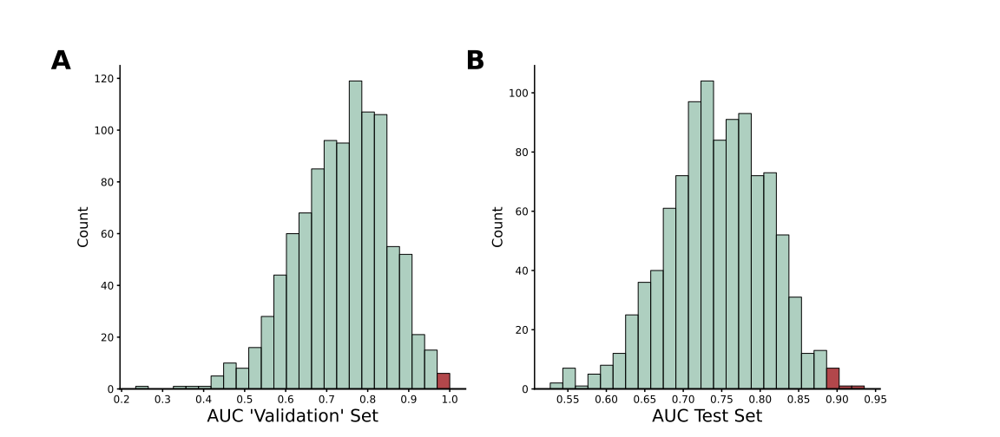
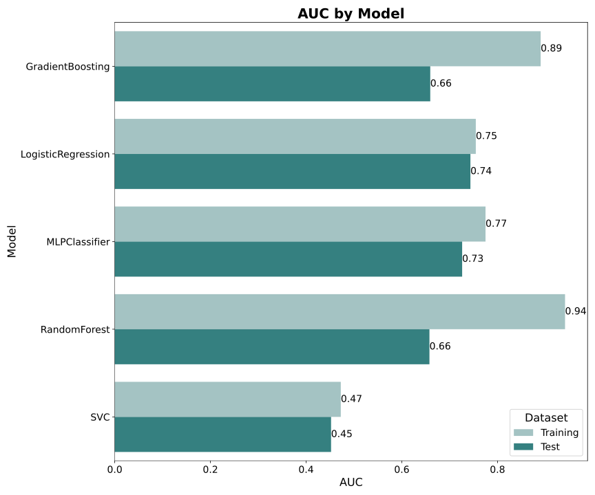
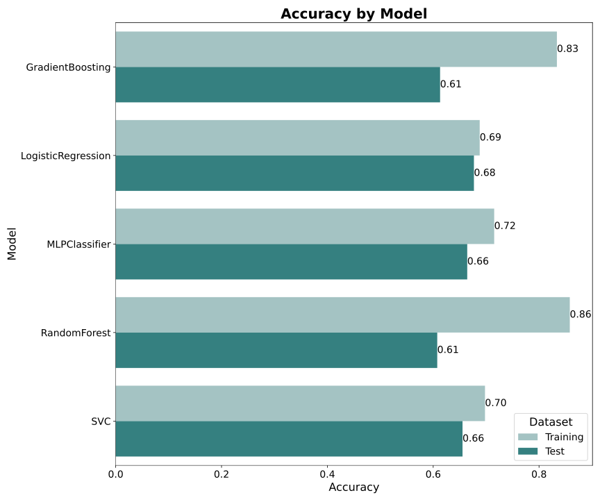

# Overstated Predictive Performance of a Pain Sensitivity Biomarker: Methodological Concerns and Reanalysis

| Authors      | Ole Goltermann          | Tamas Spisak       | Christian Büchel         |
|:-------------|:---------------------------|:----------------------|:---------------------|
| **Contact**  | o.goltermann[@]uke.de  | tamas.spisak[@]uk-essen.de | buechel[@]uke.de  |


#

This repository contains code for the re-analysis of the paper: ["Predicting Individual Pain Sensitivity Using a Novel Cortical Biomarker Signature"](https://jamanetwork.com/journals/jamaneurology/fullarticle/2829261). The analysis includes the preprocessing and modeling of original data to evaluate predictive models for individual pain sensitivity class (low vs high) based on peak-alpha frequency (PAF) and corticomotor excitability (CME). Based on our results, as well as flaws and mistakes spotted in their code, we wrote the following **Letter to the Editor**:

---
*Chowdhury, Bi et al. (2025) evaluated a biomarker for pain sensitivity, reporting a logistic regression model using peak alpha frequency (PAF) and corticomotor excitability (CME) achieved outstanding performance (AUCvalidation set = 1.0, AUCtest set = 0.88). They concluded that this biomarker is robust, reproducible, and has substantial clinical translation potential. While we appreciate this well-designed study and its open data, we identified two major methodological issues that undermine these conclusions.*

*First, the reported AUC of 1.0 in the "validation set" is fundamentally flawed. It was derived from a non-independent subset (n=16) taken directly from the training set, meaning the model was tested on data it had already seen. To calculate it, the authors selected 16 individuals from the training set after model training (using a fixed random seed of 23) and calculated the AUC for this small subset. In principle, the AUC for such a subset should match the training set’s AUC, but due to the small sample size, it is highly sensitive to the specific individuals sampled. Across 100 different random seeds, 23 was the only one producing such a favorable result (see Figure 1A). This highlights that the reported AUC of 1.0 is not a true measure of model performance but rather a consequence of an unrepresentative sub-sample where classification was artificially easy. The correct AUC to report here is 0.73. The term validation set is wrong and misleading.*

*Second, the AUC of 0.88 for the test set was based on a single, randomly chosen train-test split. Given the small sample size, this risks sampling bias, inflating performance estimates and limits generalizability. We reanalyzed the data using repeated train-test splits while keeping all other analysis steps identical. While logistic regression remained the best-performing model, actual test set performance was substantially lower: AUC = 0.74, accuracy = 0.68. The reported AUC of 0.88 was observed in only 16 out of 1000 iterations (Figure 1B), making it an outlier rather than a robust performance estimate. Remarkably, our reanalysis shows that the likelihood of both reported AUC values occurring together was just **1 in 15,625**, indicating luck rather than reliability.*

*Beyond these concerns, we identified several protocol deviations and coding errors, all documented in a publicly available GitHub repository. Furthermore, we believe it is important to stress that a machine learning approach is not well-suited for this dataset and prediction task due to the small sample size - only 16 individuals in one fold - and the use of just PAF and CME, the latter being binary.*

---

## Two main concerns about the results reported in the paper

1. The reported metric for the validation set is not based on a true validation set. The AUC and accuracy of 1.00 in the so-called “validation set” are derived from a single sub-sample of 16 individuals taken directly from the training data. Since the model was trained on the same data, the expected AUC/accuracy for sub-samples should be, on average, identical to that of the training set. Due to the small size, the estimate for this sub-sample will be highly unreliable. This “validation set” was drawn from the training data using a fixed random seed of 23 (line 180 in their code on [GitHub](https://github.com/DrNahianC/PREDICT_Scripts/blob/main/PREDICT_Scripts-main/Machine%20Learning%20Scripts/ML_classification_PAF_CME.py)). Notably, out of all random seeds from 1 to 100, seed 23 is the only one that produces such a favorable result. The observed AUC is a consequence of specific sample characteristics within these 16 individuals and does not provide a reliable estimate of the model’s performance—neither for the training set nor, even more so, for a supposed “validation set.” The histogram in **Figure 1A** illustrates the AUC distribution for random seeds ranging from 1 to 1000. As expected, it reflects the model's performance in the training set.
  
2. Similarly, the reported AUC of 0.88 for the test set is based on a single train-test split. Given the relatively small overall sample size for this type of analysis, the result is likely susceptible to biases introduced by specific sample characteristics. To mitigate this issue, we recommend implementing repeated train-test splits in the analysis pipeline and calculating average AUC and accuracy metrics. This approach provides more robust and reliable estimates of model performance. **Figure 1B** shows the AUC for our analysis with repeated data splits. The reported AUC of 0.88 in the paper is clearly an outlier and not a valid estimate of the models performance. Out of 1000 iterations, only 16 produced an AUC as high as 0.88. Importantly, the probability of observing an AUC of 0.59 or lower is just as high as obtaining the AUC reported in the paper. 


   

**Figure 1**. **(A)** Out of 1,000 sub-samples of 16 individuals taken from the training set (they call it incorrectly ‘validation’ set), only four result in an AUC of 1.0. The expected AUC for this sub-sample is 0.73, matching the AUC of the training set, as successfully depicted in the histogram. **(B)** Out of 1,000 repeated analyses, in which all analysis steps—including the latent growth model used to form pain sensitivity classes—were identical to those in the original study, only 16 produced an AUC as high as the one reported in the paper. In fact, the likelihood of obtaining an AUC of 0.59 or lower was just as high as reaching the reported value of 0.88 (P = 0.016). The joint probability of these two results is 0.0064% (1 out of 15,625).

## Deviations from their protocol
see protocol [here](https://journals.lww.com/painrpts/fulltext/2020/08000/a_novel_cortical_biomarker_signature_for.6.aspx)

<table>
  <thead style="background-color: #808080; color: white;">
    <tr>
      <th>Protocol</th>
      <th>What they actually did</th>
      <th>Influence on results</th>
    </tr>
  </thead>
  <tbody>
    <tr>
      <td>Corticomotor excitability on Day 5 (measured as map volume, a continuous variable) as a predictor for the model</td>
      <td>The difference in map volume between Day 0 and Day 5 was calculated and then binarized.</td>
      <td>The original predictor (map volume as a continuous variable) and the non-binarized difference performed worse.</td>
    </tr>
    <tr>
      <td>(...) </td>
      <td> (...) </td>
      <td> (...) </td>
    </tr>
    <tr>
      <td>(...) </td>
      <td> (...) </td>
      <td> (...) </td>
    </tr>
  </tbody>
</table>

## Errors in the code   

## Our analysis pipeline  

To reduce the risk of sample characteristic biases on the models performance estimate, we integrated a repeated split into training and test data. Additonally, we do not report metrics for a so called "validation set" but rather only report averaged metrics for training and test data with identical model configuration and sample sizes for the two sets as in the original paper. Our pipeline does the following:

1. **Split data in training and test set**: Sample size for training and test set is the same as in the original study
2. **Run the latent growth model** (based on the Rscript of the original paper) that classifies subjects into low and high pain sensitivity and uses this model for the test set classification as well (this is the "ground truth" for the later classification task)
3. **Model Training and Evaluation**: Trains several machine learning models (e.g., Logistic Regression, Random Forest, Gradient Boosting, SVC, MLPClassifier) 
4. **Result Aggregation**: Aggregates results across multiple random seeds and saves them to CSV files.
5. **Visualization**: Generates bar plots for accuracy and AUC metrics for each model.

## Requirements

To run this code, you need the following Python libraries:
- numpy
- pandas
- scikit-learn
- seaborn
- matplotlib

Ensure you have Python 3.8 or higher installed.

### Installation
You can install the required libraries using:

```bash
pip install -r requirements.txt
```

The `requirements.txt` file contains:

```txt
numpy
pandas
scikit-learn
seaborn
matplotlib
```

## How to Run the Code

1. Clone this repository:

   ```bash
   git clone https://github.com/your_username/pain-sensitivity-reanalysis.git
   cd pain-sensitivity-reanalysis
   ```

2. Set the `basepath` variable to the directory containing your input data files. The expected files in the data folder are:
   - `PAF_all.xlsx`: Contains peak-alpha frequency data.
   - `map_volume_all.xlsx`: Contains volume data for calculating CME.
   - `yawn_pain_all.csv`: Contains pain rating reports (used for ground truth classification into low and high pain sensitivity)
   - `chew_pain_all.csv`: Contains pain rating reports (used for ground truth classification into low and high pain sensitivity)
  
   The Rscript `run_LGM.R` is used to run the latent growth model.   


3. Run the Jupyter notebook or Python script. For example:

   ```bash
   jupyter notebook
   ```

4. Execute the cells in order, ensuring the data files are in the specified `basepath`.

5. Results will be saved in CSV format:
   - `results_all_runs.csv`: Contains detailed performance metrics for each random seed and model.
   - `summary_results.csv`: Contains aggregated accuracy and AUC metrics for training and test datasets.

6. Visualization outputs are saved as SVG files:
   - `Accuracy_by_Model.svg`
   - `AUC_by_Model.svg`

## Results

AUC and accuracy for the five different models are displayed here (based on 100 repetitions). 




## Contact
For questions or issues, please contact [ole.goltermann@maxplanckschools.de].

