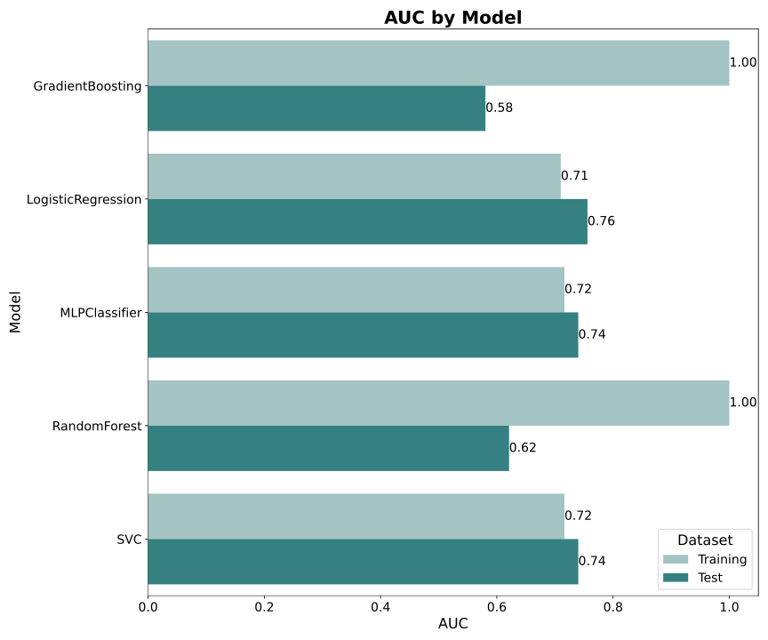
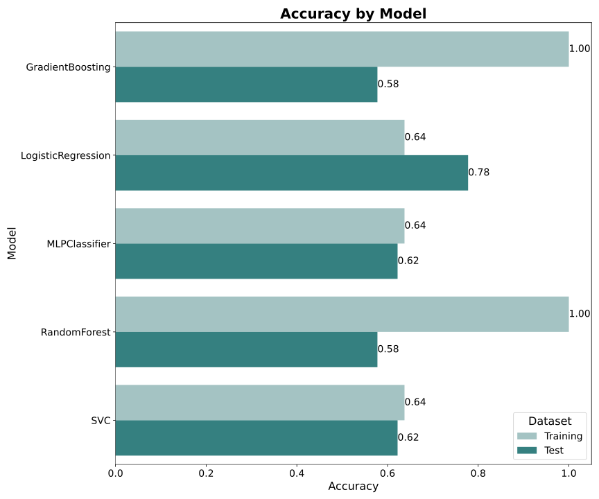

# Re-analysis of "Predicting Individual Pain Sensitivity Using a Novel Cortical Biomarker Signature"

This repository contains code for the re-analysis of the preprint: [**"Predicting Individual Pain Sensitivity Using a Novel Cortical Biomarker Signature"**](https://jamanetwork.com/journals/jamaneurology/fullarticle/2829261). The analysis includes the preprocessing and modeling of original data to evaluate predictive models for individual pain sensitivity class (low vs high) based on peak-alpha frequency (PAF) and corticomotor excitability (CME).

In the original study, Chowdhury, Bi et al. (2025) assessed the ability of a biomarker based on PAF and CME to predict pain sensitivity using a machine learning approach. Their study found that a logistic regression model demonstrated outstanding performance (AUC_validation set = 1.0, AUC_test set = 0.88). They interpreted these results as evidence that the biomarker is reliable, reproducible, and has substantial potential for clinical application. However, the notably lower AUC for the training set (AUC_training set = 0.65) compared to the validation and test sets raised concerns among us, leading to a re-analysis of their code and date. 

Our results, which we believe are a more robust estimate of the models capability, are the following:
- logistic regression model remains the winning model
- AUC_training set = .75, Accuracy_training set = .69 ; **AUC_test set = .74, Accuracy_test set = .68**.

Based on these results, we would argue against the conclusion of a biomarker with substantial potential for clinical application.

## Concerns about the results reported in the paper

We found two major issues that likely explain the odd discrepancy of the models performance in training, validation and test set. 

1. The reported metric for the validation set is not based on a true validation set. The AUC and accuracy of 1.00 in the so-called “validation set” are derived from a single sub-sample of 16 individuals taken directly from the training data. Since the model was trained on this data, the expected AUC/accuracy for this sub-sample should be identical to that of the training set or, more accurately, an inflated estimate due to the very small sample size. This “validation set” was drawn from the training data using a fixed random seed of 23 (line 180 in their code on [GitHub](https://github.com/DrNahianC/PREDICT_Scripts/blob/main/PREDICT_Scripts-main/Machine%20Learning%20Scripts/ML_classification_PAF_CME.py)). Notably, out of all random seeds from 1 to 100, seed 23 is the only one that produces such a favorable result. The observed AUC is a consequence of specific sample characteristics within these 16 individuals and does not provide a reliable estimate of the model’s performance—neither for the training set nor, even more so, for a supposed “validation set.” The histogram below illustrates the AUC distribution for random seeds ranging from 1 to 100. As expected, it reflects a slightly inflated estimate of the model's performance in the training set.
  
   

2. Similarly, the reported AUC of 0.88 for the test set is based on a single train-test split. Given the relatively small overall sample size for this type of analysis, the result is likely susceptible to biases introduced by specific sample characteristics. To mitigate this issue, we recommend implementing repeated train-test splits in the analysis pipeline and calculating average AUC and accuracy metrics. This approach would provide more robust and reliable estimates of model performance while reducing the risk of overestimating predictive power.


## Our analysis pipeline  

To reduce the risk of sample characteristic biases on the models performance estimate, we integrated a repeated split into training and test data. Additonally, we do not report metrics for a so called "validation set" but rather only report averaged metrics for training and test data with similar model configuration and sample sizes for the two sets as in the original paper. Our pipeline does the following:

1. **Split data in training and test set**: Sample size for training and test set is the same as in the original study
2. **Run the latent growth model** (based on the Rscript of the original paper) that classifies subjects into low and high pain sensitivity and uses this model for the test set classification as well (this is the "ground truth" for the later classification task)
3. **Model Training and Evaluation**: Trains several machine learning models (e.g., Logistic Regression, Random Forest, Gradient Boosting, SVC, MLPClassifier) 
4. **Result Aggregation**: Aggregates results across multiple random seeds and saves them to CSV files.
5. **Visualization**: Generates bar plots for accuracy and AUC metrics for each model.

## Requirements

To run this code, you need the following Python libraries:
- numpy
- pandas
- scikit-learn
- seaborn
- matplotlib

Ensure you have Python 3.8 or higher installed.

### Installation
You can install the required libraries using:

```bash
pip install -r requirements.txt
```

The `requirements.txt` file contains:

```txt
numpy
pandas
scikit-learn
seaborn
matplotlib
```

## How to Run the Code

1. Clone this repository:

   ```bash
   git clone https://github.com/your_username/pain-sensitivity-reanalysis.git
   cd pain-sensitivity-reanalysis
   ```

2. Set the `basepath` variable to the directory containing your input data files. The expected files in the data folder are:
   - `PAF_all.xlsx`: Contains peak-alpha frequency data.
   - `map_volume_all.xlsx`: Contains volume data for calculating CME.
   - `yawn_pain_all.csv`: Contains pain rating reports (used for ground truth classification into low and high pain sensitivity)
   - `chew_pain_all.csv`: Contains pain rating reports (used for ground truth classification into low and high pain sensitivity)
  
   The Rscript `run_LGM.R` is used to run the latent growth model.   


3. Run the Jupyter notebook or Python script. For example:

   ```bash
   jupyter notebook
   ```

4. Execute the cells in order, ensuring the data files are in the specified `basepath`.

5. Results will be saved in CSV format:
   - `results_all_runs.csv`: Contains detailed performance metrics for each random seed and model.
   - `summary_results.csv`: Contains aggregated accuracy and AUC metrics for training and test datasets.

6. Visualization outputs are saved as SVG files:
   - `Accuracy_by_Model.svg`
   - `AUC_by_Model.svg`

## Results

AUC and accuracy for the five different models are displayed here (based on 100 repetitions). 




## Contact
For questions or issues, please contact [ole.goltermann@maxplanckschools.de].

