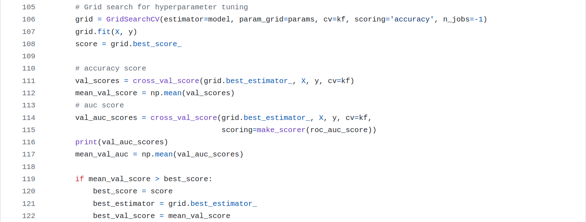

# Overstated Predictive Performance of a Pain Sensitivity Biomarker

| Authors      | Ole Goltermann          | Tamas Spisak       | Christian Büchel         |
|:-------------|:---------------------------|:----------------------|:---------------------|
| **Contact**  | o.goltermann[@]uke.de  | tamas.spisak[@]uk-essen.de | buechel[@]uke.de  |


#

This repository contains code for the re-analysis of the paper: ["Predicting Individual Pain Sensitivity Using a Novel Cortical Biomarker Signature"](https://jamanetwork.com/journals/jamaneurology/fullarticle/2829261). The analysis includes the preprocessing and modeling of original data to evaluate predictive models for individual pain sensitivity class (low vs high) based on peak-alpha frequency (PAF) and corticomotor excitability (CME). Based on our results, as well as flaws and mistakes spotted in their code, we wrote the following **Letter to the Editor**. In addition to this letter, this repository contains a list of deviations from the pre-registered protocol, errors in the original code, as well as further comments on the validity of the reporting findings. Instructions on how to use our code are at the end of this README. 

---
*Chowdhury, Bi et al. (2025) evaluated a biomarker for pain sensitivity, reporting a logistic regression model using peak alpha frequency (PAF) and corticomotor excitability (CME) achieved outstanding performance (AUCvalidation set = 1.0, AUCtest set = 0.88). They concluded that this biomarker is robust, reproducible, and has substantial clinical translation potential. While we appreciate this well-designed study and its open data, we identified two major methodological issues that undermine these conclusions.*

*First, the reported AUC of 1.0 in the "validation set" is fundamentally flawed. It was derived from a non-independent subset (n=16) taken directly from the training set, meaning the model was tested on data it had already seen. To calculate it, the authors selected 16 individuals from the training set after model training (using a fixed random seed of 23) and calculated the AUC for this small subset. In principle, the AUC for such a subset should match the training set’s AUC, but due to the small sample size, it is highly sensitive to the specific individuals sampled. Across 100 different random seeds, 23 was the only one producing such a favorable result (see Figure 1A). This highlights that the reported AUC of 1.0 is not a true measure of model performance but rather a consequence of an unrepresentative sub-sample where classification was artificially easy. The correct AUC to report here is 0.73. The term validation set is wrong and misleading.*

*Second, the AUC of 0.88 for the test set was based on a single, randomly chosen train-test split. Given the small sample size, this risks sampling bias, inflating performance estimates and limits generalizability. We reanalyzed the data using repeated train-test splits while keeping all other analysis steps identical. While logistic regression remained the best-performing model, actual test set performance was substantially lower: AUC = 0.74, accuracy = 0.68. The reported AUC of 0.88 was observed in only 16 out of 1000 iterations (Figure 1B), making it an outlier rather than a robust performance estimate. Remarkably, our reanalysis shows that the likelihood of both reported AUC values occurring together was just **1 in 25,000**, indicating luck rather than reliability.*

*Beyond these concerns, we identified several protocol deviations and coding errors, all documented in a publicly available GitHub repository. Furthermore, we believe it is important to stress that a machine learning approach is not well-suited for this dataset and prediction task due to the small sample size - only 16 individuals in one fold - and the use of just PAF and CME, the latter being binary.*

---

## Two main concerns about the results reported in the paper

1. The reported metric for the validation set is not based on a true validation set. The AUC and accuracy of 1.00 in the so-called “validation set” are derived from a single sub-sample of 16 individuals taken directly from the training data. Since the model was trained on the same data, the expected AUC/accuracy for sub-samples should be, on average, identical to that of the training set. Due to the small size, the estimate for this sub-sample will be highly unreliable. This “validation set” was drawn from the training data using a fixed random seed of 23 (line 180 in their code on [GitHub](https://github.com/DrNahianC/PREDICT_Scripts/blob/main/PREDICT_Scripts-main/Machine%20Learning%20Scripts/ML_classification_PAF_CME.py)). Notably, out of all random seeds from 1 to 100, seed 23 is the only one that produces such a favorable result. The observed AUC is a consequence of specific sample characteristics within these 16 individuals and does not provide a reliable estimate of the model’s performance—neither for the training set nor, even more so, for a supposed “validation set.” The histogram in **Figure 1A** illustrates the AUC distribution for random seeds ranging from 1 to 1000. As expected, it reflects the model's performance in the training set.
  
2. Similarly, the reported AUC of 0.88 for the test set is based on a single train-test split. Given the relatively small overall sample size for this type of analysis, the result is likely susceptible to biases introduced by specific sample characteristics. To mitigate this issue, we recommend implementing repeated train-test splits in the analysis pipeline and calculating average AUC and accuracy metrics. This approach provides more robust and reliable estimates of model performance. **Figure 1B** shows the AUC for our analysis with repeated data splits. The reported AUC of 0.88 in the paper is clearly an outlier and not a valid estimate of the models performance. Out of 1000 iterations, only 10 produced an AUC as high as 0.88. Importantly, the probability of observing an AUC of 0.59 or lower is just as high as obtaining the AUC reported in the paper. 


   


**Figure 1**. **(A)** Out of 1,000 sub-samples of 16 individuals taken from the training set (questionably  labeled as ‘validation’ set), only 4 result in an AUC of 1.0 (p=0.004). The mean AUC for this sub-sample is 0.73, matching the cross-validated AUC of the training set, as depicted in the histogram. (B) Out of 1,000 repeated analyses, in which all analysis steps - including the latent growth modelling - were identical to those in the original study, only 10 produced an AUC as high as the one reported in the paper (p=0.01). The joint probability of observing these two metrics is 0.004% (1 out of 25,000).

## Deviations from their [protocol](https://journals.lww.com/painrpts/fulltext/2020/08000/a_novel_cortical_biomarker_signature_for.6.aspx)

Listed below are only deviations that have an impact on the reported metrics, beyond the two critical issues mentioned above.

<table>
  <thead style="background-color: #808080; color: white;">
    <tr>
      <th>Protocol</th>
      <th>What they actually did</th>
      <th>Influence on results</th>
    </tr>
  </thead>
  <tbody>
    <tr>
      <td>Corticomotor excitability on Day 5 (measured as map volume, a continuous variable) as a predictor for the model</td>
      <td>The difference in map volume between Day 0 and Day 5 was calculated and then binarized.</td>
      <td>The original predictor (map volume as a continuous variable) and the non-binarized difference performed worse.</td>
    </tr>
    <tr>
      <td>"The sample of 150 subjects will first be randomly divided into an outer-training set (n = 100) and an outer-testing set (n = 50). The ratios of high- vs low-pain sensitive individuals will be matched between the 2 cohorts" (...) </td>
      <td> Test set is imbalanced. 24 are coded as high, 14 as low pain sensitivity. </td>
      <td> As demonstrated above, the AUC of the test set is unrepresentative and a clear (favorable) outlier. </td>
    </tr>
  </tbody>
</table>

Adhering to the original pre-registered analysis, we got an AUC = `0.72`, accuracy = `0.68` for the training set and AUC = `0.71`, accuracy = `0.68` for the test set.

## Errors in the code   

We only report errors here that have an impact on model performance indices. 

Original Script is [here](https://github.com/DrNahianC/PREDICT_Scripts/blob/main/PREDICT_Scripts-main/Machine%20Learning%20Scripts/ML_classification_PAF_CME.py)

1. **Parameter tuning for Models**: 

     ClassifierTuner is imported, but not used for hyperparamter tuning at all
   
     

2. **Imputing data for training set**:

    Data is imputed in the trainings set for the whole set. That leads to information leakage between the k-folds. 
    
    

    
3. **Parameter space for Classifiers**
    
    Logistic regression: Maximizing maxiter is not a real hyperparameter for logistic regression. 

    

    Gradient Boosting: Learning rate 0.01 is used twice, Max depth of `None` doesn't make sense here

    

    Support Vector Classifier: Optimizing `gamma` doesn't make sense with `kernel='linear'`

    

    Mulit-layer Perceptron Classifier: alpha=0 is incorrect, it should always be positive; learning rate options could be added here

    
      
4. **AUC/Accuracy for so-called validation set**

    The authors report an AUC and accuracy of 1 for the 'validation' set. However, as shown above, its not an actual validation set, but rather a small sub-sample of 16 individuals from the training set, using a particular seed (**=23**) to sample these individuals. Here the code, they use to generate this result.

   (1) Here predictors of the training set are assigned to `X` and outcome to `y`

    

   (2) Now (AFTER model training and locking of model), 16 individuals are drawn from the training data (X,y) using a **fixed random seed** of **23** (as shown this leads to an extreme unrepresentative sample that produces a very favorable result).

    

   (3) AUC is calculated for this sub-sample an reported as validation set AUC. 

    

   (4) The correct AUC to report would be either the average AUC across the 5 folds (**0.65**) or the performance of the locked model in the training set (**0.73**). This is done already here:

    

    It is strange that the authors don't report the AUC they already calculated for their 5 folds (internal validation sets), which would correctly reflect the performance of the models in their particular analysis. Instead, they draw 16 people again out of the set the model is trained on (AND set the random seed to 23, a seed that is not used anywhere else) and report AUC for only these 16 people.

## Further comments 

- The paper reports a wide range of sensitivity analyses. However, it is important to note that these do not affect the issues we raised above. For all their additional analyses, the calculated AUC and accuracy will still drop significantly as well.
- The authors report that they randomly split the data into training and test sets. To replicate their exact split, we used the train_test_split() function from scikit-learn, which they also employed in their scripts. However, no random seed between 1 and 10,000,000 reproduced the split reported in the paper. If their split was indeed random, this suggests that they either used a random seed greater than 10,000,000 or, contrary to all other instances in their code, did not set a seed at all or used a different package for the split.

## Our analysis pipeline  

To reduce the risk of sample characteristic biases on the models performance estimate, we integrated a repeated split into training and test data. Additonally, we do not report metrics for a so called "validation set" but rather only report averaged metrics for training and test data with identical model configuration and sample sizes for the two sets as in the original paper. Our pipeline does the following:

1. **Split data in training and test set**: Sample size for training and test set is the same as in the original study
2. **Run the latent growth model** (based on the Rscript of the original paper) that classifies subjects into low and high pain sensitivity and uses this model for the test set classification as well (this is the "ground truth" for the later classification task)
3. **Model Training and Evaluation**: Trains several machine learning models (e.g., Logistic Regression, Random Forest, Gradient Boosting, SVC, MLPClassifier) 
4. **Result Aggregation**: Aggregates results across multiple random seeds and saves them to CSV files.
5. **Visualization**: Generates bar plots for accuracy and AUC metrics for each model.

## Requirements

To run this code, you need the following Python libraries:
- numpy
- pandas
- scikit-learn
- seaborn
- matplotlib

Ensure you have Python 3.8 or higher installed.

### Installation
You can install the required libraries using:

```bash
pip install -r requirements.txt
```

The `requirements.txt` file contains:

```txt
numpy
pandas
scikit-learn
seaborn
matplotlib
```

## How to Run the Code

1. Clone this repository:

   ```bash
   git clone https://github.com/your_username/PAF_reanalysis.git
   cd PAF_reanalysis
   ```

2. Run the Jupyter notebook

3. Execute the cells in order, ensuring the data files are in the specified `basepath`. The path is determined automatically. 

4. Results will be saved in CSV format:
   - `results_all_runs.csv`: Contains detailed performance metrics for each random seed and model.
   - `summary_results.csv`: Contains aggregated accuracy and AUC metrics for training and test datasets.

5. Visualization outputs are saved as SVG files:
   - `Accuracy_by_Model.svg`
   - `AUC_by_Model.svg`

## Results

AUC and accuracy for the five different models are displayed here (based on 1000 repetitions). 


## Contact
For questions or issues, please contact [ole.goltermann@maxplanckschools.de].

